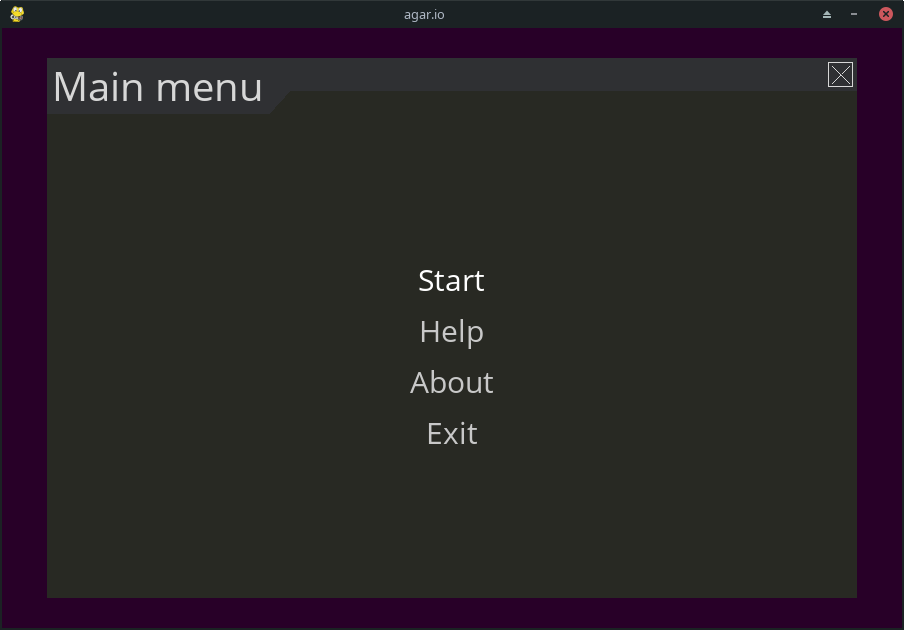
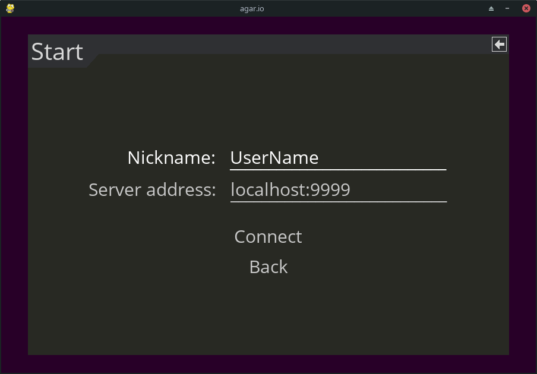
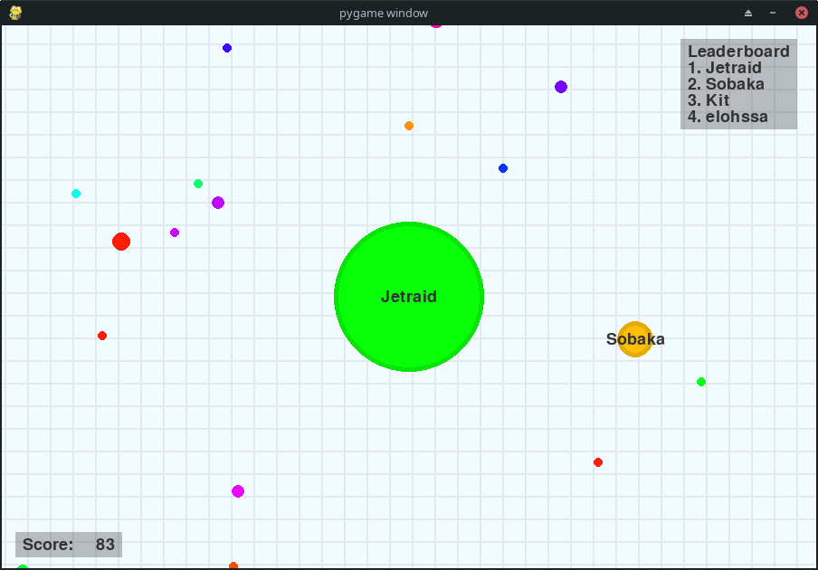

# CS5100 Foundation of AI Final Project: AI Agent for Agar.io

  <!-- Add your training plot -->

## Project Overview
We implemented a Q-learning-based AI agent to autonomously play Agar.io. Our agent was designed to learn strategies for mass accumulation through reward-based learning.

## Key AI Components
- **Reinforcement Learning**: Q-learning algorithm implementation
- **Reward Structure**:
    - ATE_CELL_REWARD_AMT = 20
    - ATE_PLAYER_REWARD_AMT = 1000
    - IDLE_REWARD_AMT = -1
    - DEATH_REWARD_AMT = -5000
- **State Representation**:
  - Most_foods_area
  - Smallest_player_area
  - Biggest_player_area

## Implementation Challenges
- High-dimensional state space requiring simplification
- Delayed rewards affecting learning efficiency
- Real-time decision making constraints

## Final Results Analysis
Our implementation yielded suboptimal performance with several key observations:

1. **Training vs Testing Gap**:
   - Training score: 58.7 ± 12.3 (mean ± std)
   - Testing score: 52.1 ± 14.9
   - The minimal difference suggests limited generalization

2. **Learning Curve Analysis**:
   
   - Plateau reached after ~400 episodes
   - Testing performance consistently 10-15% below training

3. **Key Limitations**:
   - Over-simplified state representation
   - Difficulty handling dynamic multiplayer scenarios
   - Inadequate exploration of advanced strategies (splitting, baiting)

## How to Reproduce
```bash
# Train the model (will generate progress plots)
python ai_trainer.py --episodes 500

# Evaluate the trained agent
python ai_evaluator.py --episodes 100
```
--------------------
# agar.io
This is multiplayer python implementation of game [agar.io](https://en.wikipedia.org/wiki/Agar.io).


## Stack
- Python3
- [PyGame](https://www.pygame.org/)
- [pygame-menu](https://github.com/ppizarror/pygame-menu)
- [socket](https://docs.python.org/3/library/socket.html)
- [loguru](https://github.com/Delgan/loguru)


## Features
- [x] Full game loop
- [x] HUD with score and top players
- [x] Splitting by "Space" key
- [x] Shooting by "W" key
- [x] Players receive information only about the nearest chunks
- [x] Communication between the client and the server occurs via sockets


## Setup
Clone the repository and change the working directory:

    git clone https://github.com/alexandr-gnrk/agario.git
    cd agario
Create and activate the virtual environment:

    python3 -m venv ./venv
    source ./venv/bin/activate
Install requirements:

    pip3 install -r requirements.txt

## Usage

    usage: agario.py [-h] [-wt WIDTH] [-ht HEIGHT] [-s] [-p PORT]

    Python implementation of game agar.io

    optional arguments:
      -h, --help            show this help message and exit
      -wt WIDTH, --width WIDTH
                            screen width
      -ht HEIGHT, --height HEIGHT
                            screen height
      -s, --server          start game server
      -p PORT, --port PORT  port number for server

### Examples
Run client:

    python3 agario.py

Run server:

    python3 agario.py --server

Run server with specified port:

    python3 agario.py --server --port 7839

## Screenshots




