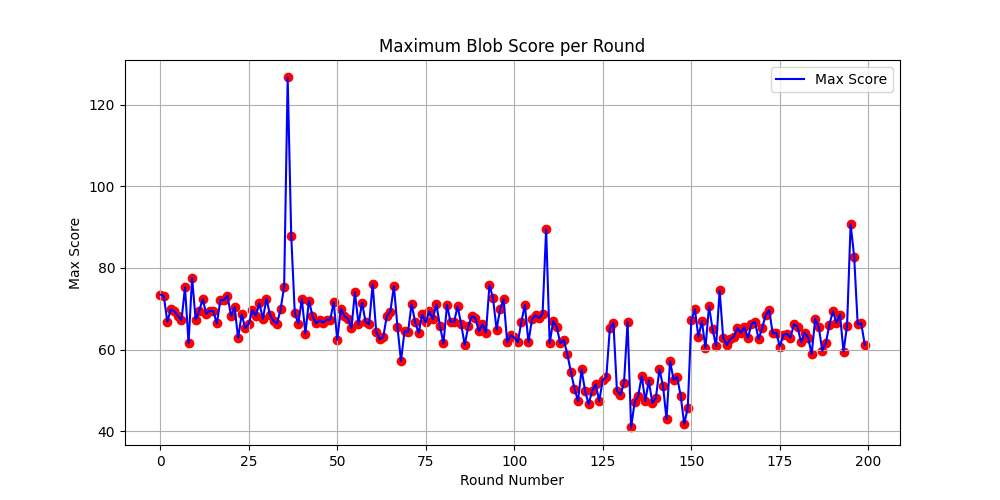

# CS5100 Foundation of AI Final Project: AI Agent for Agar.io

## Project Overview
We implemented a Q-learning-based AI agent to autonomously play Agar.io. Our agent was designed to learn strategies for mass accumulation through reward-based learning.

## Key AI Components
- **Reinforcement Learning**: Q-learning algorithm implementation
- **Reward Structure**:
    - ATE_CELL_REWARD_AMT = 20
    - ATE_PLAYER_REWARD_AMT = 1000
    - IDLE_REWARD_AMT = -1
    - DEATH_REWARD_AMT = -5000
- **State Representation**:
  - Most_foods_area
  - Smallest_player_area
  - Biggest_player_area

## Final Results Analysis
Our implementation yielded suboptimal performance with several key observations:

1. **Training vs Testing Gap**:
   
   - Training score: 70.7 ± 5.3 (mean ± std)
   - Testing score: 65.1 ± 4.2
   - The minimal difference suggests limited generalization

2. **Key Limitations**:
   - Over-simplified state representation
   - Difficulty handling dynamic multiplayer scenarios
   - Limited actions cannot be matched to probe results

## Experimental Branch: NewModel
We explored an alternative initialization approach in a separate branch:

**Key Differences from Main Branch**:
- Guided Q-table initialization with:
  ```python
  # Priority-based initial values
  FOOD_REWARD = 30       # Slightly > cell reward (20)
  ESCAPE_REWARD = 50     # Significantly > idle penalty (-1) 
  HUNT_REWARD = 1200     # Slightly > player reward (1000)
  
## How to Reproduce
```bash
# Train the model (will generate progress plots)
python multiple_instance.py  

```

## Setup
Clone the repository and change the working directory:
    
    git clone https://github.com/alexandr-gnrk/agario.git](https://github.com/haigshiroz/Custom-Agario
    cd agario
    
Create and activate the virtual environment:
    
    python3 -m venv ./venv
    source ./venv/bin/activate
    
Install requirements:
    
    pip3 install -r requirements.txt
    
    If it doesn't work, please try using:
    pip install -r requirements.txt

## Usage 
### q_learning 
    usage: q_learning.py [-h] [--train | --test] [--empty] [--history] [--agents AGENTS] [--no-server]
    
    Launch multiple agar.io instances
    
    optional arguments:
      -h, --help       show this help message and exit
      --train          run in training mode (epsilon=1.0)
      --test           run in testing mode (epsilon=0.0)
      --empty          initialize empty Q-tables
      --history        continue training from existing Q-tables
      --agents AGENTS  number of client instances (default: 10)
      --no-server      skip launching server
      
### agario
     
    usage: agario.py [-h] [-wt WIDTH] [-ht HEIGHT] [-s] [-p PORT] [-m] [--train | --test] [--empty] [--history]
    
    Python implementation of game agar.io with AI training
    
    optional arguments:
      -h, --help            show this help message and exit
      -wt WIDTH, --width WIDTH
                            screen width (default: 900)
      -ht HEIGHT, --height HEIGHT
                            screen height (default: 600)
      -s, --server          start game server
      -p PORT, --port PORT  port number for server (default: 9999)
      -m, --manual          control the player manually
    
    Training/testing modes (mutually exclusive):
      --train               run in training mode (epsilon=1.0)
      --test                run in testing mode (epsilon=0.0)
    
    Training options:
      --empty               initialize empty Q-tables (default for training)
      --history             continue training from existing Q-tables
  
### Examples
    
Training AI Agents：
    
    # Launch 10 training agents + server (default is 10 agents)
    python q_learning.py --train
    
    # Launch 5 training agents with existing Q-table
    python q_learning.py --train --history --agents 5

Testing AI Agents：

    # Launch 10 test agents  (default is 10 agents)
    python q_learning.py --test 
    
    
Basic Game Control:

     # Manual control
    python agario.py -m
    
    # Start server
    python agario.py --server
    
    # Start server in training mode
    python agario.py --server --train

Run server with specified port:

    python3 agario.py --server --port 7839


## Screenshots


