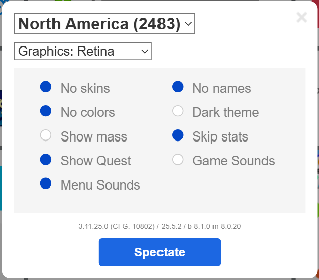

# Deep Q-Network (DQN) Branch

### Structure
The main DQN script can be found in DQN.py. This file contains code to control the player and take screenshots using pyautogui, train the DQN using CNNs, graph the results, and run the trained model. To just run the trained model, you would comment out line 421 (run_training()).

When training the model, the weights and statistics get saved in the root folder. In order to make sure we protect successful training results while experimenting, we manually move "good" results to the SAVED folder and generally read from there when importing the weights and statistics. 

We additionally analyze what the input to the DQN looks like in AnalyzeNN.py.

### Requirements

To run the scripts, we create a virtual environment and important packages by running the following commands:

```
python -m venv .venv
.\.venv\Scripts\activate

# To capture screenshots and control player
pip install pyautogui

# For DQN
pip install torch

# For DQN
pip install torchvision

# To graph results
pip install matplotlib

# To graph results
pip install numpy

# To render images
pip install Pillow

# To calibrate screen
pip install pynput
```

### Running

Open up a new tab and go to the official Agar.io website: https://agar.io/#ffa

In order for pyautogui to successfully and efficiently capture data, we run Agar.io on a Google Chrome browser with an adblocker (Pie Adblock) to allow for seamless training between deaths. Otherwise, simple modifications would be needed to detect the "Play" button. Lastly, make sure your game settings turns off any "distractions" with the following configuration:



Close out of the settings and make sure the "Play" button is in view.

Now, return back to the python script and run the script. The script will automatically use the "Alt Tab" shortcut to switch windows to the Agar.io site.

**IN ORDER TO CALIBRATE THE SCREEN:** Click on the top left of the playing field, the bottom right of the playing field, and then hover your mouse to a GREEN PORTION of the "Play" button, alt tab back to where you are running the code, and click one last time. Then, the script will again alt tab back to the game and start playing/training.

This script will take control of your mouse and keyboard, but if at any point you need to stop the program, moving the cursor to any corner of the screen will throw a pyautogui exception. 